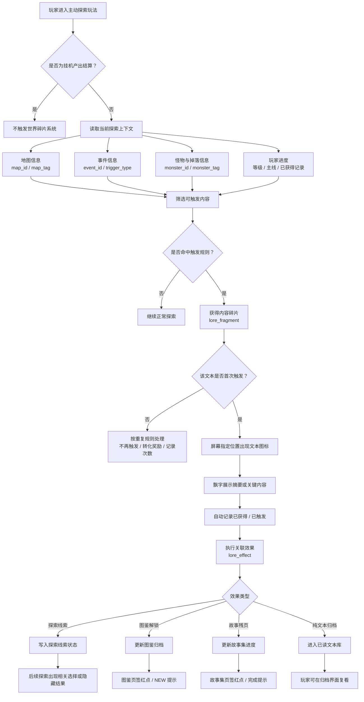
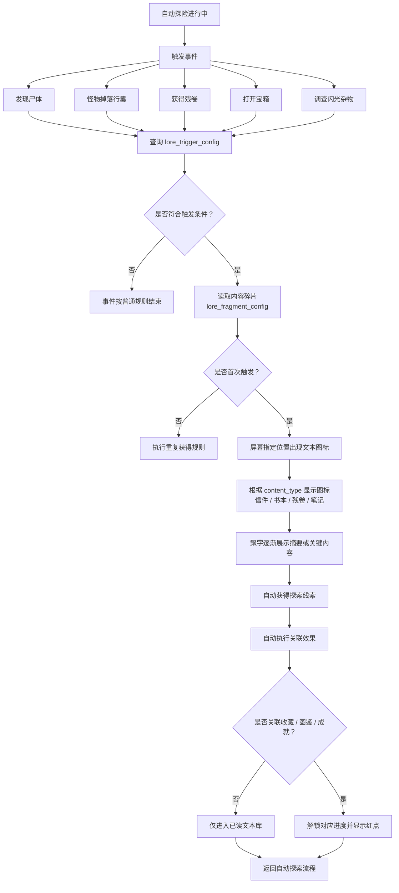
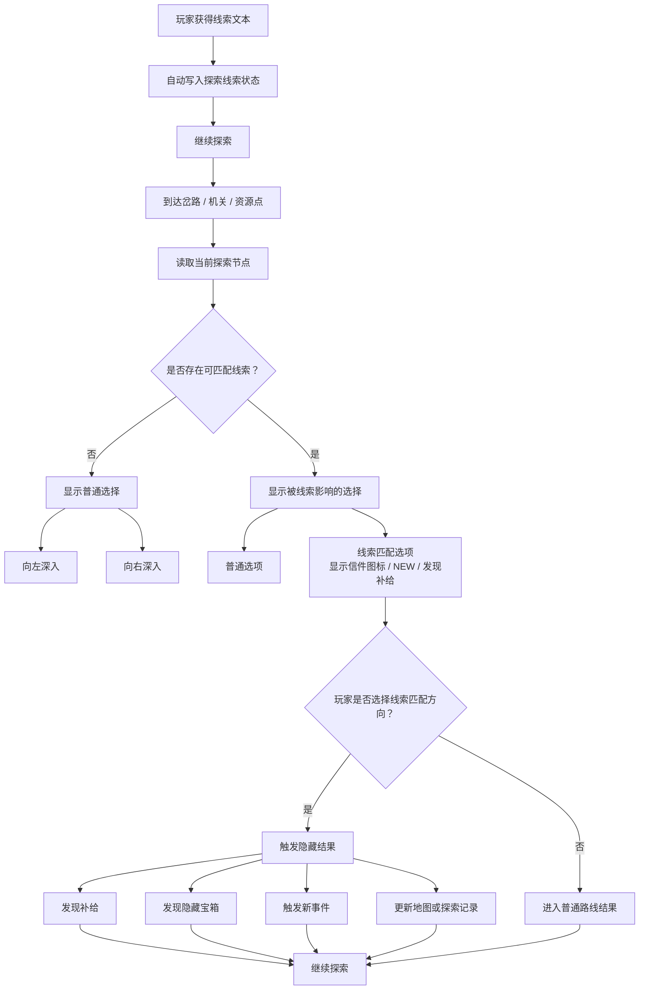
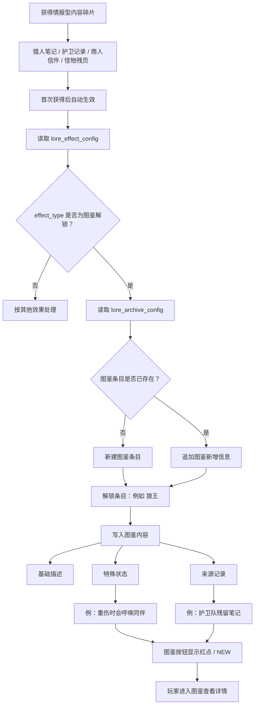
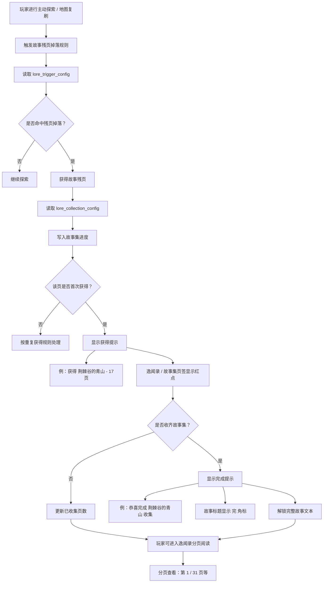
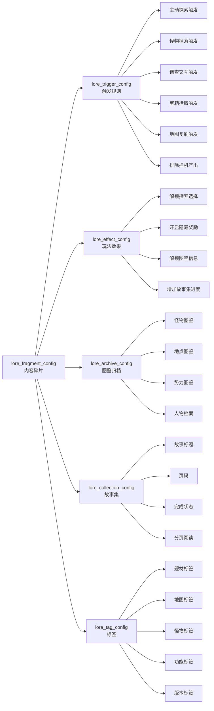

# 世界碎片与逸闻系统_逻辑流程结构图

状态：草案  
关联文档：[世界碎片与逸闻系统.md](E:\PK\设计文档\世界碎片与逸闻系统.md)

本文档用于整理“世界碎片与逸闻系统”的系统逻辑流程。当前重点覆盖 4 个核心流程：

- 探索中触发文本
- 探索选择受文本影响
- 图鉴解锁
- 故事集收集

## 1. 系统总流程

## 2. 探索中触发文本

关键规则：

- 文本不需要玩家停下流程完整阅读。
- 首次触发时通过图标与飘字传达关键内容。
- 效果默认自动生效。
- 后续可在已读文本、图鉴或故事集中复看。

## 3. 探索选择受文本影响

关键规则：

- 文本线索进入探索状态后，后续节点可以读取该状态。
- 线索匹配选项需要有明显 UI 提示，例如信件图标、NEW 角标、绿色收益提示。
- 玩家未选择线索方向时，仍可进入普通路线结果。
- 是否允许玩家未获得线索也发现隐藏结果，由具体地图节点配置决定。

## 4. 图鉴解锁

关键规则：

- 图鉴信息由文本来源解锁，而不是只通过击杀解锁。
- 图鉴中的“应对倾向”应尽量包装为来源记录中的观察，而不是系统直接给攻略。
- 可支持同一图鉴条目多阶段解锁：基础信息、特殊状态、生态记录、弱点记录等。

## 5. 故事集收集

关键规则：

- 故事残页只从主动探索、地图复刷、事件、宝箱、战斗掉落等主动玩法中获得。
- 不进入挂机产出。
- 故事集需要支持页码、总页数、完成状态、红点提示和完整故事查看。
- 收齐奖励是否包含数值奖励、称号、头像框或纯收藏成就，后续再定。

## 6. 配置关系结构图

## 7. 逻辑优先级

1. 排除挂机产出。
2. 判断触发来源是否属于主动玩法。
3. 根据地图、事件、怪物、玩家进度筛选触发规则。
4. 判断是否首次触发。
5. 首次触发时显示图标与飘字。
6. 自动写入线索、图鉴、故事集或已读文本。
7. 对图鉴、逸闻录、收藏、成就等入口显示红点。
8. 后续探索节点读取线索状态，改变可选项或结果。

