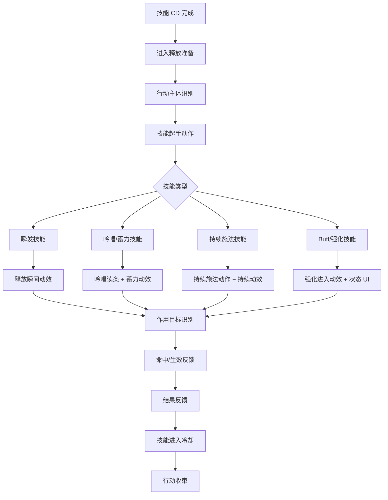
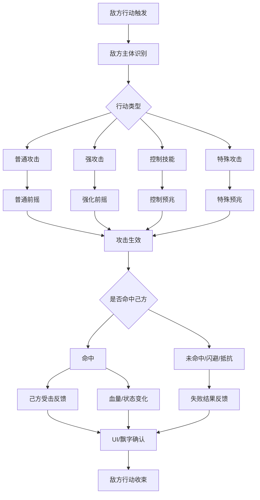
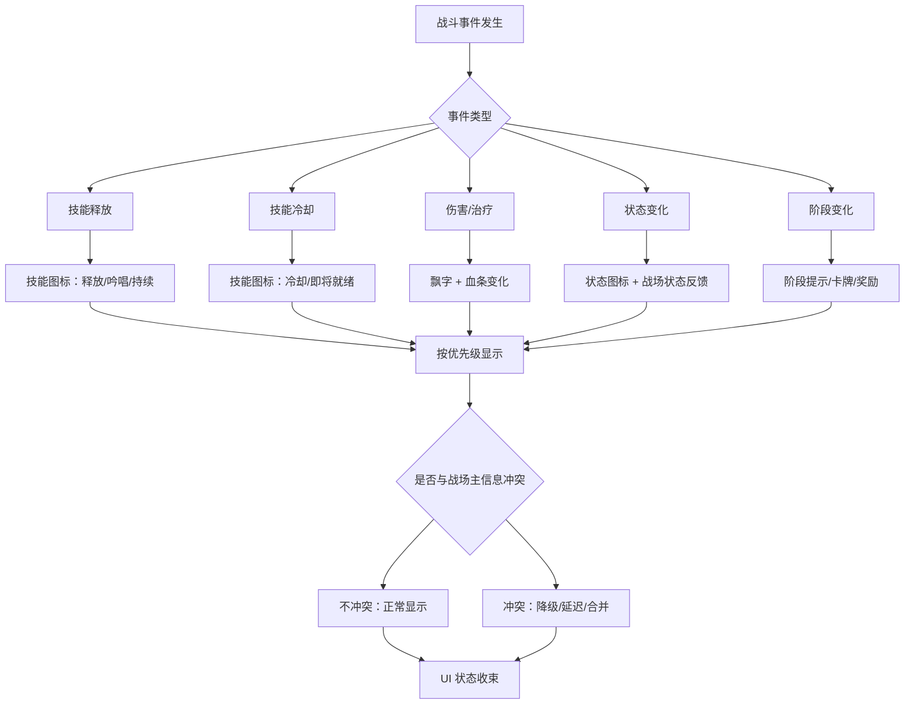
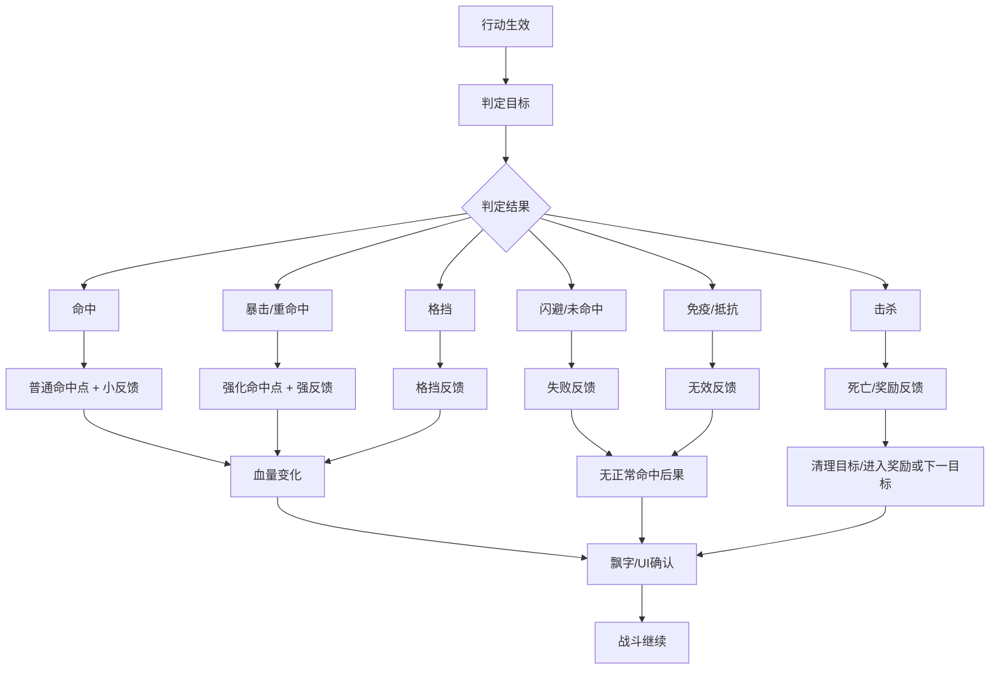

# [PK]战斗表现-规则框架（含部分示意图）V-0.1

| 表现层核心目标： 看清谁在行动：明确区分己方与敌方行为主体 看清行动影响谁：清晰展示技能或攻击的作用目标 看清命中与结果：即时反馈伤害、治疗、状态等效果 看清状态变化：实时反映Buff、Debuff、控制等状态 看清战斗节奏变化：直观呈现战斗阶段、波次、Boss转阶段等关键节点 |
| --- |

本框架旨在统一战斗中的表现设计语言，其核心是先确定表现模块和底层规则，而非绑定具体的技能表、武器、法术或怪物类型。当前战斗系统建立在两个基本前提之上：己方技能按冷却时间自动释放，敌方按自身攻击节奏自动行动。玩家的核心参与方式是通过观察战斗过程、理解结果反馈，并据此选择成长路径。

一、己方行动表现模块设计

己方行动表现模块负责向玩家解释：己方角色正在做什么、技能是否生效，以及这次行动的价值是什么。

1. 模块总览

| 项目 | 内容 |
| --- | --- |
| 模块目标 | 让玩家看懂己方技能正在自动释放，并理解这次技能的生效点和价值。 |
| 画面关注点 | 底部技能UI、己方手部/武器/施法动作、敌方命中点、敌方结果飘字。 |
| 表现链路 | 冷却完成 → 起手/准备 → 施法/生效 → 命中反馈 → 冷却/收束。 |
| 前端关注 | 技能图标状态、冷却/吟唱/持续施法状态、释放触发时机、命中事件同步。 |
| 美术关注 | 起手动作、释放特效、命中特效、Buff/Debuff进入反馈、持续施法状态。 |
| 配套图示 | 己方技能释放链路图；飘字位置/颜色/优先级图。 |
| 产出目标 | 前端能知道每个技能阶段要触发什么表现；美术能知道每类技能需要补哪些动作/特效资产。 |

2. 技能释放表现流程

以下流程图定义了从技能冷却完成到行动收束的完整表现链路：

流程规则：

冷却完成不等于释放就绪：必须有释放准备阶段或图标状态变化，让玩家感知到“技能即将释放”。

起手动作是行动标识：负责告诉玩家“己方正在行动”，是连接意图与执行的关键帧。

技能类型决定表现重点：瞬发技能看爆点，吟唱技能看过程，持续施法看维持状态，Buff技能看进入效果和状态UI。

结果反馈后必须收束：在结果反馈之后，技能必须明确进入冷却或收束状态，避免表现无边界，导致玩家误判技能状态。

3. 表现分层设计（需补充各层分解说明图）

动作层

包含普通攻击动作、技能释放动作、技能持续施法动作、技能被打断动作、己方受伤动作、行动恢复动作。

关键规则：重要技能必须有可识别的起手动作；持续施法必须能看出“仍在施法”的状态；行动结束需要有明确的收束动作，避免技能表现之间相互干扰；受伤或被控制状态的表现不能与释放动作的表现产生冲突。

动效层

包含瞬发技能动效、持续施法动效、蓄力/吟唱动效、Buff增强动效、Debuff施加动效、持续区域动效。

关键规则：瞬发技能强调释放瞬间的视觉爆发；持续施法强调过程的稳定状态；Buff/Debuff需要有进入反馈，不能仅依赖UI图标；持续动效不能长期遮挡主要目标和关键UI信息。

结果层

包含命中特效、命中目标反馈、伤害/治疗飘字、暴击/格挡/未命中提示、状态进入提示、击杀/奖励反馈、轻微震动或节奏停顿。

关键规则：命中点的表现优先级高于大面积的范围特效；飘字不能作为唯一的反馈手段，必须结合其他表现；群体技能要清晰区分范围覆盖特效和实际命中目标的反馈；击杀、暴击、控制等高价值事件的表现强度必须高于普通命中。

| 己方行动表现的核心是建立“意图-执行-结果”的清晰链路。通过起手动作告知意图，通过类型化动效展示执行过程，最后通过分层的结果反馈确认价值，确保玩家在自动战斗中仍能理解每一个己方行为的因果。 |
| --- |

二、敌方行动表现与威胁传达

敌方行动表现模块负责向玩家解释：敌人要做什么、危险何时发生，以及玩家为什么受伤或被控。

1. 模块总览

| 项目 | 内容 |
| --- | --- |
| 模块目标 | 让玩家看懂敌人正在攻击、攻击何时生效，以及己方为什么掉血或被控。 |
| 画面关注点 | 敌人身体动作、攻击特效、生效帧、己方受击反馈、己方结果飘字。 |
| 表现链路 | 敌方行动触发 → 前摇/准备 → 攻击生效 → 己方受击确认 → 行动收束。 |
| 前端关注 | 敌方行动事件、攻击生效帧、己方受击事件、状态变化和UI同步。 |
| 美术关注 | 普通攻击/强攻击前摇差异、命中特效、受击反馈、死亡/收束动作。 |
| 配套图示 | 敌方攻击表现三段式图；己方结果飘字示意图。 |
| 产出目标 | 前端能把敌方行为和己方受击事件对齐；美术能按攻击强度制作可读前摇和命中反馈。 |

2. 攻击/威胁表现流程

敌方攻击遵循“预兆→生效→结果”的三段式表现结构，流程如下：

流程规则：

行动必须先被识别：敌方行动触发后，必须经过主体识别，再进入具有差异化的前摇或预兆阶段。

伤害/控制遵循三段式：所有敌方攻击行为必须严格遵守“预兆（前摇）→ 生效（命中帧）→ 结果（反馈）”的流程。

预兆规格与威胁等级挂钩：控制技能、强攻击、特殊攻击的预兆表现规格（如时长、特效强度、音效）必须显著高于普通攻击。

失败结果不走成功路径：对于未命中、闪避、抵抗等情况，不能播放完整的成功命中受击反馈，必须使用独立的失败反馈表现。

3. 表现分层设计（需补充各层分解说明图）

动作层

包含待机动作、普通攻击前摇、强攻击前摇、技能释放动作、受伤动作、死亡动作、Boss阶段动作。

关键规则：所有敌方攻击必须有可识别的前摇动作；强攻击的前摇必须在时长、幅度或特征上区别于普通攻击；控制技能或Boss技能的前摇规格必须更高；敌人受伤、死亡的动作要能有效清理战场上的冗余战斗信息。

威胁动效层

包含攻击预警、控制预警、范围预警、弹道/飞行物、地面危险、屏幕边缘危险、Boss大招预兆。

关键规则：威胁预兆不能只依赖UI小图标，必须在战场上有明确的视觉表现；控制类技能必须通过预兆让玩家提前感知“危险类型”（如冻结、眩晕）；Boss的大招必须拥有独立且高规格的预兆表现。

战场威胁分区原则：威胁表达需要让玩家理解“危险从哪里来”。在视野受限或第一人称/近背视角下，部分地面信息可能不可见，此时威胁来源需要转化到屏幕空间表达，例如屏幕边缘光效、方向性镜头晃动、特效从对应方向进入、受击音效方向感等。详细视角适配规则后续单独整理，本框架当前只保留“威胁来源必须可读”的底层原则。

结果层

包含己方受击反馈、己方掉血飘字、己方状态变化、红屏/屏幕边缘反馈、技能按钮受限、玩家血条变化。

关键规则：己方受伤反馈必须能让玩家看出伤害来源；被控、中毒、减速等状态需同时具备战场视觉反馈和UI图标反馈；玩家受击飘字与敌方受击飘字必须在出现位置、颜色和显示优先级上进行明确区分；结果反馈的视觉层级应高于己方技能特效，避免被遮盖。

| 敌方表现的核心是“可读的威胁”。通过差异化的前摇区分攻击强度，通过明确的预兆传递危险类型，最终将攻击结果清晰反馈给玩家，形成“预警-承受-理解”的认知闭环，这是自动战斗中玩家策略性观察的基础。 |
| --- |

三、UI信息表现与状态同步

UI信息表现模块负责解释自动战斗系统正在执行什么，以及结果如何影响战局，确保玩家无需查阅配置表也能通过界面理解战斗。

1. 模块总览

| 项目 | 内容 |
| --- | --- |
| 模块目标 | 让玩家不用读配置，也能通过UI看懂技能、状态、伤害、治疗和战斗阶段变化。 |
| 画面关注点 | 技能栏、冷却/吟唱/持续施法状态、血条、状态图标、敌我飘字、阶段提示。 |
| 表现链路 | 战斗事件发生 → UI状态响应 → 优先级判断 → 显示/合并/降级 → 状态收束。 |
| 前端关注 | UI状态机、显示优先级、同屏信息合并、冷却/吟唱/禁用状态同步。 |
| 美术关注 | 图标状态、飘字字体与颜色、状态图标层级、阶段提示样式。 |
| 配套图示 | 需要分别补充示意图：技能 CD/吟唱 UI、状态进入/持续/结束、战场信息分区、特效遮挡与画面预算等后续图。 |
| 产出目标 | 前端能建立UI事件响应规则；美术能按优先级设计图标、飘字和提示样式。 |

2. UI信息响应流程

UI响应由战斗事件驱动，并需处理信息优先级与冲突，其核心流程如下：

流程规则：

UI响应由事件触发：所有UI状态变化必须由具体的战斗事件触发，禁止孤立、无源头的UI表现。

信息需按优先级管理：不同重要度的UI信息（如玩家受伤 vs 普通伤害）必须拥有不同的显示优先级，不能同等弹出。

冲突时采用降级策略：当UI信息与战场核心视觉信息（如Boss大招特效）冲突时，UI应主动降级、延迟显示或合并同类项。

UI状态必须收束：所有UI提示或状态必须有明确的结束或收束表现，避免残留信息误导玩家。

3. UI分类与对比（需补充各层分解说明图）

UI系统主要分为技能UI、状态UI、飘字UI和战斗阶段UI四大类。其中，技能UI与状态UI是核心的子系统，其分类对比如下：

| 技能 UI 状态分类 技能冷却：图标灰显并显示倒计时 即将释放：图标轻微高亮或呼吸效果 正在释放：图标常亮并可能伴有施法动画 吟唱/读条：图标上叠加读条进度 持续施法：图标变化以表示维持状态 释放成功：短暂的成功反馈（如闪光） 被打断/失效：明确的打断或失效提示 禁用/不可用：图标完全灰显且不可交互 | 状态 UI 类型分类 己方 Buff：增益效果，显示在己方状态区 己方 Debuff：减益效果，显示优先级高 敌方 Buff：敌人增益，显示在目标状态区 敌方 Debuff：敌人减益，显示优先级高 控制状态：如眩晕、冻结，需特殊图标 层数：可叠加状态的当前层数显示 持续时间：状态剩余时间的倒计时 状态刷新/结束：状态刷新或消失的提示 |
| --- | --- |

飘字UI用于结果确认，包含敌方受伤、己方受伤、治疗、状态变化、暴击、格挡、闪避、未命中、免疫、反弹等多种类型，其核心规则是分区显示（敌我飘字区分离）和优先级管理。

战斗阶段UI用于标记战斗节奏变化，包含开战提示、波次提示、Boss阶段提示、卡牌选择、奖励提示、战斗结束等，其核心规则是Boss阶段提示规格最高，卡牌选择是明确的节奏断点。

4. 屏幕信息分区规则

屏幕信息分区用于解决“信息放在哪里”。不同信息按照重要度、作用对象和打断程度放入不同区域，避免敌我飘字、状态、阶段提示和低优先级信息混在一起。

| 分区 | 主要内容 | 显示规则 |
| --- | --- | --- |
| 场上区（上半屏） | 敌方受伤、暴击、击杀、敌方Buff/Debuff变化 | 跟随敌方单位移动，玩家抬头即可看到“怪怎么了”。 |
| 角色区（下半屏） | 己方受伤、治疗、护盾、己方状态变化 | 跟随己方单位或固定在屏幕下方，玩家低头即可看到“自己人怎么了”。 |
| 中央提示区 | 开战、波次、Boss转阶段、卡牌选择、战斗胜利/失败 | 用于打断注意力，拥有更高遮挡优先级，但必须短暂且可收束。 |
| 边缘区 | 危险来源提示、受击方向、屏幕边缘泛红/泛蓝 | 不遮挡中央视野，用于余光可见的危险或方向提示。 |
| 角落区（信息密度区） | DOT小伤害、持续掉血、低优先级P6信息 | 信息过多时降级到角落或弱化显示，小字不抢注意力。 |

核心原则：越关键、越需要立刻理解的信息，越靠近屏幕中央；越次要、越偏持续确认的信息，越可以靠边角或弱化。中央提示区只用于战斗阶段、选择、结算等明确节奏断点，不能被普通伤害或普通状态频繁占用。

| UI是战斗信息的翻译器与调度器。它不创造信息，而是将复杂的战斗事件转化为可读的视觉信号，并通过严格的优先级管理，在有限的屏幕空间内，确保玩家始终看到最关键的信息。 |
| --- |

四、特殊/强化表现与结果分级

本模块定义命中结果的表现差异体系，确保普通、强化、失败等不同结果在视觉上有明确区分，从而提升战斗反馈的层次感和信息量。

1. 模块总览

| 项目 | 内容 |
| --- | --- |
| 模块目标 | 定义普通结果、强结果、失败结果、群体结果之间的表现差异，避免所有命中看起来一样。 |
| 画面关注点 | 命中点、受击特效、飘字强度、音效/震动、死亡/清理反馈、Boss/特殊反馈。 |
| 表现链路 | 行动生效 → 结果判定 → 强弱/成功失败分级 → 对应表现路径 → UI确认。 |
| 前端关注 | 命中结果枚举、表现优先级、失败结果路径、群体/多段/持续伤害节流。 |
| 美术关注 | 普通/暴击/击杀/格挡/抵抗的特效差异，受击点、DOT持续状态和强弱层级。 |
| 配套图示 |  |
| 产出目标 | 前端能按结果类型触发不同表现；美术能知道哪些结果必须强化，哪些必须克制。 |

2. 命中与结果反馈流程

不同的命中结果必须走不同的表现路径，其核心流程如下：

流程规则：

结果路径分离：命中、重命中/暴击、格挡、未命中/闪避、免疫/抵抗、击杀必须使用截然不同的视觉、音效表现路径。

强化结果需多维度增强：对于暴击、重命中等高价值结果，需要在命中点特效、受击反馈、音效、飘字等多个维度进行增强。

失败结果禁止成功表现：格挡、闪避、未命中等结果，严禁播放成功的命中受击反馈，必须使用独立的、强度更弱的“失败”或“无效”表现。

成功防御需要正向表达：格挡、闪避、护盾吸收等结果虽然不造成正常伤害，但对防御方来说是“成功防住了”。这类结果需要有轻量正反馈，例如盾反光效、偏移残影、清脆防御音效或稳定的蓝白色提示，避免让玩家误以为“什么都没发生”。

击杀需衔接后续逻辑：击杀表现需要包含目标清理，并自然过渡到奖励结算或切换下一目标的状态。

3. 结果分级体系与表现要求（需要补充不同效果的示意）

结果分级主要包括强弱分级、成功/失败分级和单体/群体分级。不同结果类型对应的表现增强要求如下：

| 结果类型 | 表现强度要求 | 动效增强 | 音效增强 | 飘字增强 |
| --- | --- | --- | --- | --- |
| 普通命中 | 克制，为高价值事件留空间 | 小幅命中点特效 | 基础命中音效 | 普通颜色，标准大小 |
| 重命中/暴击 | 显著强化，突出价值 | 强化命中点+可能全屏闪白 | 厚重、清脆的特殊音效 | 放大、金色/橙色，特殊字体 |
| 格挡 | 明确区分于命中，表达“防御成功” | 盾牌、格挡光效，无受击抖动 | 金属撞击、防御成功音效 | 蓝色/灰色，“格挡”文字 |
| 闪避/未命中 | 弱于格挡，表达“攻击落空” | 轻微偏移特效，无命中点 | “嗖”的落空音效 | 灰色，“闪避”“未命中” |
| 免疫/抵抗 | 强于未命中，表达“完全无效” | 护盾、光环等无效化特效 | 低沉、无效化的音效 | 紫色/深灰，“免疫”“抵抗” |
| 击杀 | 短暂但强烈的终结反馈 | 爆炸、消散等死亡特效+可能慢放 | 终结技、胜利音效 | 最大、白金/金色，“击杀！” |
| DOT/持续伤害 | 低频、持续、可感知状态来源 | 目标身上持续状态特效或受影响材质 | 低强度循环或间歇音效 | 小号、低频、可合并，避免刷屏 |

强弱分级（普通命中、重命中、暴击、破防、克制命中、击杀、Boss有效命中）要求强弱差异不能只靠数字大小，重命中以上的结果需要在动作、特效、音效、飘字中至少选择两项进行增强。

成功/失败分级（命中、未命中、闪避、格挡、免疫、抵抗、反弹）要求失败结果不能播放成功命中表现，格挡/闪避/护盾吸收等成功防御结果需要给防御方正反馈，格挡/免疫/抵抗需与正常命中明确区分，反弹需要同时表达“来源”和“返回结果”。

单体/群体分级要求单体技能强调接触点，群体技能强调范围和实际命中目标，多段技能强调节奏避免同帧堆叠，持续技能强调边界和状态，全屏技能只用于Boss大招等高价值事件。

3.1 DOT/持续伤害专项规则

DOT（持续伤害）不同于普通多段攻击。多段攻击强调一次技能内的连续命中节奏，DOT强调一个状态在一段时间内持续生效，玩家需要感知“目标正在持续掉血/受影响”，而不是看到一堆小数字。

表现规则：

持续状态视觉：DOT必须有持续状态表现，例如目标身上的毒雾、灼烧、冰霜、蛛网、腐蚀边缘或Debuff图标呼吸，不能只靠每跳伤害数字表达。

低频飘字：DOT飘字默认低频显示，可按固定间隔抽样显示，或在多跳后合并为一次数字，避免自动战斗中刷屏。

状态来源可读：DOT飘字颜色应跟状态类型绑定，例如毒为绿色、燃烧为橙红、冰冻为冰蓝，方便玩家理解持续伤害来源。

开始与结束要明确：DOT进入时需要有状态施加反馈；DOT结束、刷新或叠层变化时，需要通过状态UI或轻量战场反馈确认。

优先级控制：DOT单跳默认低于普通命中和控制状态，但当DOT导致击杀、破盾、触发连锁效果时，应提升到对应高价值结果表现路径。

4. 受击表现绑定规则

为简化实现并保证一致性，当前阶段采用统一的受击点绑定规则：

默认中心点：普通小怪、中型怪、精英怪默认使用模型中心点播放所有受击表现（特效、飘字、音效）。

轴向偏移修正：对于中大型怪，若中心点位置不合适（如过高），优先通过X/Y/Z轴偏移进行修正，而非新增复杂挂点。

群体技能表现分离：群体技能可以拥有独立的范围主特效，但每个实际命中的单体目标，其受击反馈仍基于各自的默认中心点。

Boss/特殊怪预留：仅为Boss或特殊机制怪物预留“特殊受击点”的概念，不作为当前普通怪物的实现要求。

失败结果复用中心点：格挡、免疫、抵抗等失败或减免结果可以复用默认中心点，但其表现强度与视觉样式必须与正常命中明确区分。

5. 飘字分区与位置规则

飘字在屏幕上按逻辑分区显示，确保敌我信息不混杂：

敌方结果飘字区：位于敌人默认中心点上方，跟随敌人移动，包含敌人受到的伤害、暴击、击杀等数字。

己方结果飘字区：位于屏幕下半区或己方状态附近，包含玩家及己方单位受到的伤害、治疗、获得的状态等。

状态/特殊提示区：用于显示格挡、免疫、反弹等非数字的文本提示。

低优先级信息降级区：用于显示DOT小伤害、持续掉血、小额多段伤害等P6信息。当同屏信息过多时，这类信息可以合并、缩小、延迟或降级到角落区，避免抢走暴击、击杀、玩家受击、Boss阶段提示等关键事件的注意力。

中央提示区不承载普通飘字：中央区域只用于Boss转阶段、波次、卡牌选择、战斗结算等需要中断注意力的阶段信息。普通伤害、普通治疗、普通DOT不进入中央提示区。

5.1 颜色规则

颜色是区分飘字类型最直观的手段：

敌方普通伤害：白色 / 浅黄色（默认，不抢夺高价值表现）

己方受伤：红色 / 橙红色（明确危险信号）

治疗/恢复：绿色（与伤害形成鲜明对比）

暴击/强命中：黄色 / 橙色 / 金色（高价值输出标识）

击杀：金色 / 白金色（可短暂使用更强效果）

格挡/减免：蓝灰色 / 白蓝色（表达防御成功）

闪避/未命中：灰色 / 白灰色（弱于格挡）

免疫/抵抗：紫灰色 / 深灰色（表达完全无效）

状态变化：使用对应状态色（如冰蓝色、毒绿色）

5.2 显示优先级与动效强度

当同屏信息过多时，按照以下优先级（P0最高，P6最低）进行显示控制与动效调节：

P0 玩家受伤 / 被控：保留完整表现，明显的弹出/抖动。

P1 击杀 / 暴击 / 破防：保留完整表现，放大+短促冲击。

P2 控制状态变化：保留完整表现，短文字+状态色。

P3 治疗 / 护盾 / 恢复：可简化，但要可读，小幅上浮。

P4 格挡 / 免疫 / 抵抗 / 反弹：可简化，稳定弹出。

P5 普通伤害：正常显示，小幅上浮+快速淡出。

P6 多段小伤害 / 持续伤害：可合并、节流、缩小或延迟显示。

处理规则：P0-P2优先级的事件必须保留完整表现；P3-P4可适当简化但需保持可读性；P5正常显示；P6可进行合并或弱化处理。同一目标短时间内多次受到小伤害时优先合并数字。

五、镜头与战斗节奏表现

镜头与战斗节奏表现负责定义：玩家如何“观看”战斗，以及哪些事件应该打破自动战斗的均匀节奏。该模块不替代动作、动效、结果和UI反馈，而是作为全局表现调度层，用来提升关键事件的观看权重、节奏层次和战斗段落感。

1. 模块总览

| 项目 | 内容 |
| --- | --- |
| 模块目标 | 避免自动战斗从头到尾保持同一观看节奏，让关键事件被玩家明确感知。 |
| 画面关注点 | 战场构图、目标位置、命中点、Boss阶段变化、击杀清理、UI与飘字可读性。 |
| 表现链路 | 战斗事件触发 → 事件价值判断 → 镜头/节奏调度 → 关键反馈展示 → 回归常规战斗。 |
| 前端关注 | 事件优先级、镜头触发条件、顿帧/暂停时长、同屏事件合并、镜头状态回正。 |
| 美术关注 | 镜头强调幅度、命中冲击感、阶段断点演出、击杀收束、强弱事件差异。 |
| 配套图示 | 后续可补充镜头调度优先级图、战斗节奏峰谷图、Boss转阶段节奏图。 |
| 产出目标 | 前端能按事件价值触发镜头/节奏规则；美术能知道哪些事件需要更高规格的观看表现。 |

2. 表现分层设计

镜头与节奏层分为三个子层：镜头调度层、时间节奏层、段落收束层。

镜头调度层

负责处理镜头推进、拉远、轻微跟随、震动、特写、回正等观看方式。

关键规则：普通事件以稳定观看为主；高价值事件可以触发轻量镜头强调；Boss转阶段、关键击杀、玩家濒死等事件可以使用更高规格的镜头调度；镜头强化必须服务信息理解，不能遮挡技能UI、飘字或关键受击反馈。

时间节奏层

负责处理加速、减速、顿帧、短暂停顿、慢动作和节奏断点。

关键规则：普通命中不触发明显顿帧；重命中、暴击、强攻击命中可以使用短促节奏强化；击杀和Boss转阶段可以形成明确节奏断点；同一时间多个高价值事件触发时，需要合并节奏反馈，避免连续停顿。

段落收束层

负责处理战斗事件结束后的信息清理和节奏回归。

关键规则：击杀后需要清理目标和冗余反馈；Boss转阶段后需要清理旧阶段信息并展示新阶段；卡牌选择、奖励选择、战斗胜利等节点需要从战斗噪声中收束出来；节奏断点结束后必须回归常规自动战斗状态。

3. 事件触发分级

镜头与节奏表现不由技能类型直接决定，而由事件价值决定。事件价值越高，越允许触发更强的镜头和节奏调度。

| 事件层级 | 事件类型 | 镜头规则 | 节奏规则 |
| --- | --- | --- | --- |
| 常规事件 | 普通命中、普通治疗、DOT单跳 | 不触发或极弱反馈 | 保持原节奏 |
| 中价值事件 | 重命中、暴击、成功防御、强攻击命中 | 可轻微推进、轻震或命中点强调 | 可短促顿帧或节奏加重 |
| 高价值事件 | 击杀、关键控制、反弹关键结果、DOT击杀 | 可进行短促镜头强调或目标清理跟随 | 可形成短暂停顿或清理节奏 |
| 阶段事件 | Boss转阶段、卡牌选择、奖励选择、战斗胜利 | 可拉远、居中、回正或阶段镜头 | 必须形成明确节奏断点 |

4. 使用约束

镜头与节奏表现需要遵循以下约束：

稳定优先：自动战斗的基础观看状态必须稳定，不能因为频繁镜头变化导致玩家失去战局理解。

高价值才强化：普通伤害、普通DOT单跳、普通小怪死亡不触发强镜头或强节奏。

短促可恢复：镜头推进、震动、顿帧、短暂停顿都必须有明确回正，不能让战斗长时间停在演出态。

信息不遮挡：镜头和节奏强化不能压住技能UI、状态UI、关键飘字和受击确认。

合并不叠加：同一时间多个事件触发时，按最高价值事件执行一次镜头/节奏反馈，不重复叠加。

Boss可升级：Boss战允许更高规格的镜头和节奏调度，但仍需要保留玩家对场上状态的连续理解。

5. 与其他模块的关系

镜头与节奏不是独立播放的表现，而是由前面模块中的事件触发：

己方行动表现触发：关键技能释放、暴击、击杀、Buff强化首次释放。

敌方行动表现触发：强攻击命中、控制命中、Boss技能、玩家濒死。

UI信息表现触发：Boss阶段提示、卡牌选择、奖励结算、战斗结束。

特殊/强化表现触发：重命中、成功防御、反弹、DOT击杀、免疫关键技能等高价值结果。

最终规则：镜头和节奏只强化关键事件，不承担基础信息说明。基础信息仍由动作、动效、结果反馈和UI来完成。
