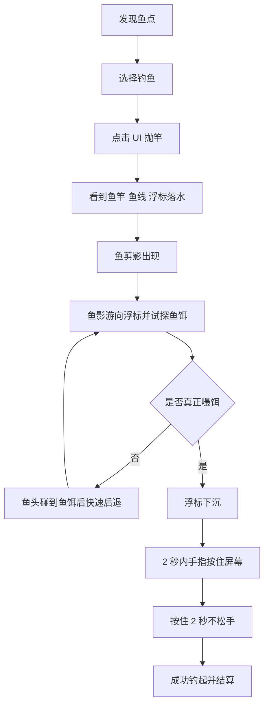

# 钓鱼系统设计方案

更新时间：2026-05-13

## 1. 设计定位

钓鱼是探索过程中的轻量副玩法。它让玩家在战斗和推进之外，通过发现鱼点、短暂停留、钓获结果，获得休息感、期待感、收集感和意外发现感。

核心体验：

> 我本来只是路过钓条鱼，结果可能钓到了这片区域的秘密。

钓鱼不应被设计成纯资源入口，也不应做成复杂钓鱼模拟。它更像是地图探索中的“安静事件点”，为主玩法提供节奏变化和内容补充。

## 2. 钓鱼方式

### 2.1 设计原则

钓鱼方式不能只是“点击鱼点，读条，领奖”。这样会像普通采集点，缺少期待和记忆点。

建议采用：

> 第一人称抛竿 + 鱼影试探 + 浮标下沉 + 按住收竿 + 结果揭示

玩家需要观察鱼影和浮标变化，在鱼真正嘬饵后完成一次轻量反应。玩法参考《集合啦！动物森友会》的钓鱼节奏，但改为适配 PK 的第一人称探索表现。

### 2.2 基础流程

基础体验重点：

- 第一人称视角下，玩家能看到鱼竿、鱼线、浮标落水。
- 鱼剪影出现后，会主动游向浮标。
- 鱼影每次接近浮标时，玩家都会产生“这次会不会咬”的期待。
- 真正嘬饵时浮标下沉，提示玩家进入收竿操作。
- 成功收竿后再揭示具体收获。

### 2.3 收竿判定

第一版采用轻判定，不做复杂 QTE。

推荐方式：

| 阶段 | 玩家操作 | 作用 |
|---|---|---|
| 鱼影试探 | 不操作 | 制造期待与误判 |
| 浮标下沉 | 2 秒内按住屏幕 | 进入收竿 |
| 水花拉扯 | 按住 2 秒不松手 | 成功钓起 |

规则说明：

- 一旦鱼影真正嘬食成功，浮标会明显下沉。
- 玩家需要在 2 秒内手指按住屏幕。
- 按住后需要持续 2 秒，期间不能松手。
- 按住过程中，鱼饵处播放水花动效。
- 2 秒结束后，必定成功钓起。

这套规则让玩家需要观察和反应，但不会因为复杂操作产生强挫败。

### 2.4 鱼影试探规则

鱼影出现后，会围绕浮标进行若干次试探。

基础规则：

- 首先，在 1-4 次中随机决定该鱼最终嘬饵次数。
- 最终嘬饵次数 - 1，即为鱼影游向鱼饵但不嘬饵的次数。
- 如果结果为 0，则鱼影第一次游向鱼饵就会真正嘬饵。
- 每次试探前，随机等待 1-2 秒。
- 试探表现为鱼影游向鱼饵，鱼头碰到鱼饵后快速后退一段距离。
- 到达最终嘬饵次数时，鱼影真正嘬食，浮标下沉。

举例：

- 随机结果为 1：鱼影第一次游向鱼饵就嘬饵。
- 随机结果为 4：鱼影先试探 3 次，第 4 次才嘬饵。

### 2.5 后续反馈分层

反馈分层暂时不在第一版细做，但可以作为后续增强方向。

后续可考虑：

- 不同鱼类稀有度对应不同水花表现。
- 大鱼或特殊掉落对应更明显的鱼影动作。

第一版先不把鱼剪影与鱼体型、稀有度、鱼类分类强绑定。

## 3. 分阶段制作优先级

钓鱼系统按 P0/P1/P2/P3 分阶段制作。每一阶段不只是加功能，而是增加一种明确体验。

| 阶段 | 核心目标 | 玩家新增乐趣 |
|---|---|---|
| P0 | 钓鱼能玩 | 第一人称抛竿、鱼影试探、按住收竿，有稳定收获 |
| P1 | 钓鱼更有期待 | 增强鱼影、浮标、水花和结果揭示表现 |
| P2 | 钓鱼有追求 | 为了稀有鱼、区域鱼、图鉴目标反复探索 |
| P3 | 钓鱼有故事 | 钓鱼能带出区域事件、NPC 委托和活动目标 |

## 4. P0：能钓鱼，有结果

P0 目标是验证钓鱼玩法是否成立：玩家是否愿意在探索中停下来，是否期待收竿结果。

### 4.1 必要内容

| 内容 | 说明 |
|---|---|
| 固定鱼点 | 地图上稳定存在，玩家可主动前往 |
| 第一人称抛竿 | 点击 UI 后看到鱼竿、鱼线、浮标落水 |
| 鱼影试探 | 鱼影 1-4 次接近浮标，最终一次嘬饵 |
| 按住收竿 | 浮标下沉后 2 秒内按住屏幕，并持续 2 秒 |
| 普通鱼产出 | 保证玩家不空手 |
| 少量特殊掉落 | 让玩家意识到钓鱼不只是资源 |
| 鱼类图鉴雏形 | 记录已获得鱼类 |

### 4.2 P0 乐趣

P0 的乐趣很简单：

- 玩家看到鱼点，会想顺手试一下。
- 鱼影多次靠近浮标，会制造“是不是要咬了”的期待。
- 浮标下沉后按住屏幕，形成一次简单但明确的收获参与感。
- 偶尔钓到漂流瓶、生锈钥匙这类特殊物，形成第一次惊喜。

P0 不追求深度，只验证钓鱼是否能成为探索中的有效停顿点。

## 5. P1：强化表现，有期待

P1 目标是强化钓鱼过程的表现，让玩家更清楚地感受到“水下有东西在接近”。

### 5.1 增加内容

| 内容 | 说明 |
|---|---|
| 鱼影表现强化 | 鱼影靠近、停顿、后退更清晰 |
| 浮标表现强化 | 浮标轻晃、下沉、水圈扩散 |
| 收竿水花 | 玩家按住期间播放水花动效 |
| 结果揭示表现 | 先出现水花或鱼影，再展示收获 |

### 5.2 P1 乐趣

P1 的乐趣来自“我看得出来它快咬了”。

玩家会经历：

- 鱼影靠近浮标，玩家开始屏息。
- 鱼影碰一下又退开，制造误判和期待。
- 浮标突然下沉，玩家立刻按住屏幕。
- 水花持续 2 秒后，收获揭示。

这一阶段重点不是提高难度，而是让钓鱼更有节奏和悬念。

## 6. P2：有目标，有追求

P2 目标是让玩家为了特定目标主动去钓鱼，而不是只在路过时顺手点一下。

### 6.1 增加内容

| 内容 | 说明 |
|---|---|
| 鱼点品质 | 普通鱼点、黄金鱼点 |
| 区域鱼 | 不同地图有不同鱼类 |
| 稀有鱼 | 低概率或轻条件出现 |
| 图鉴目标 | 每个区域有鱼类收集进度 |
| 简单鱼饵 | 用于提高某类鱼概率 |

### 6.2 P2 乐趣

P2 的乐趣来自“我想钓到某个东西”。

玩家会开始形成目标：

- 这张地图还有一种鱼没钓到。
- 黄金鱼点可能更容易出稀有鱼。
- 换一种鱼饵，也许能提高目标鱼概率。

这一阶段开始形成重复探索动力。玩家不是为了基础资源钓鱼，而是为了补图鉴、找稀有鱼、完成区域目标。

## 7. P3：有故事，有联动

P3 目标是让钓鱼成为世界探索的入口之一。

### 7.1 增加内容

| 内容 | 说明 |
|---|---|
| 钓鱼事件 | 钓上特殊旧物后触发小事件 |
| NPC 委托 | 渔夫、商人、居民提出轻量需求 |
| 区域传闻 | 特殊鱼或旧物关联地图背景 |
| 活动玩法 | 钓鱼挑战、区域鱼王、限时收集 |

### 7.2 P3 乐趣

P3 的乐趣来自“这片水域有故事”。

例如：

- 玩家钓上漂流瓶，得知附近沉船位置。
- 玩家钓上贵族戒指，触发城镇 NPC 的认领委托。

这一阶段不需要把钓鱼做成长剧情系统。重点是让钓鱼偶尔带出地图之外的内容，让玩家相信每个水域都可能藏着一点秘密。

## 8. 制作范围与验证

### 8.1 第一版建议范围

P0 第一版建议控制在：

- 2-3 个地图区域。
- 每个区域 1-2 个鱼点。
- 8-12 种鱼。
- 2-3 种稀有鱼。
- 2-4 个非鱼掉落。
- 1 个轻量鱼类图鉴。

第一人称抛竿、鱼影试探、浮标下沉、按住收竿属于 P0 核心流程，不建议再拆成可选内容。P1 主要负责强化表现，而不是补齐基础操作。

### 8.2 关键验证问题

第一版需要验证：

- 玩家是否愿意在探索中停下来钓鱼？
- 钓鱼过程是否有期待感？
- 收竿操作是否轻松但有参与感？
- 玩家是否能记住特殊掉落？
- 鱼类图鉴是否能形成轻量收集动力？

### 8.3 设计边界

钓鱼第一版应避免：

- 高强度 QTE。
- 长时间读条。
- 高频失败。
- 大量条件限制。
- 过强资源产出。
- 绑定核心战斗成长。

当前结论：

钓鱼第一版应先做成“探索中的鱼点 + 第一人称抛竿 + 鱼影试探 + 浮标下沉 + 按住收竿 + 稳定收益 + 少量惊喜 + 鱼类图鉴雏形”。等玩家证明愿意玩，再扩展表现强化、区域鱼、稀有鱼、鱼饵、事件、NPC 委托和活动玩法。
